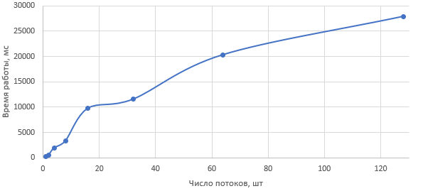

## Лабораторная работа 3. Ассоциативные массивы, пулы

---

1. Реализовать структуру данных (языки: C++/C желательно, Java допускается, но хуже)
2. Разработать простой тест
3. Оценить эффективность, построить графы, проанализировать, сформулировать выводы.
4. Написать отчет с результатами экспериментов и выводами.

---

Задание - неблокируемая хеш-таблица: lock-free hopscotch hash map.

Представлен только потокобезопасный hash map.

#### Бенчмарк

Каждый поток выполняет 100000 операций. Из них: 23% - add, 23% - get, 20% - remove, 34% - contain.

Число потоков - 1, 2, 4, 8, 16, 32, 64, 128.

Тестовая машина: Intel Core i5-7200U, 2 ядра, 4 потока, RAM 8 GB.

Результат работы бенчмарка:

```
threads,time
1,189
2,492
4,1969
8,3332
16,9764
32,11551
64,20325
128,27871
Process finished with exit code 0
```



#### Выводы

Алгоритм Lock-free Hopscotch Hashmap основан на алгоритме Hopscotch Hashing. Оригинальный алгоритм имеет высокую производительность, позволяет пропускать или «перепрыгивать» нерелевантные элементы, что позволяет осуществлять быстрый поиск, вставку и удаление.

По результатам бенчмарка видно, что с увеличением числа потоков растет время работы. При этом после 16 потоков скорость роста уменьшается. Lock-free версия алгоритма теоретически должна показать лучший результат, то есть меньшее время работы при том же соотношении операций и числе потоков.

